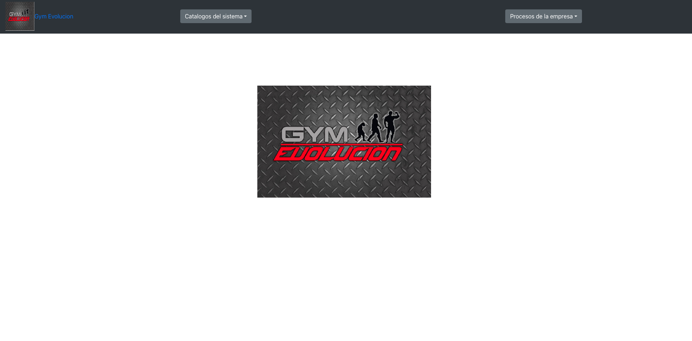
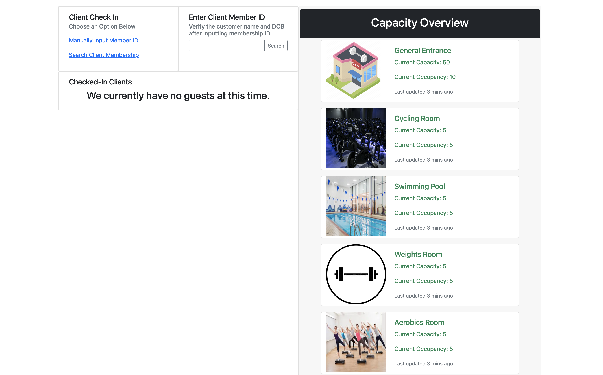

# GYM Management System.

This gym management system has the purpose to help to manage the information regarding clients, payments, and details of the organization in a simple and systematic way so there is a control of the information and tools to manipulate the information in a way that the workflow is smooth.

The application has different modules to work with the data, you can see the users that are on the gym, add new users that will register and capture their data, edit existing users, and check on their payments, and you also get the option to export information in a beautiful table format so you can take that data and move it to the application of choice to take reports and handle it.

It also lets you Check in into the gym so the tracking of capacity is measured and controlled.

Everything connecting the client which is done with React with the MySQL database in jawsdb and Express server for backend.

Working integrated from Heroku https://www.heroku.com/.

## There are several components to this system to work in the totality, here you can find the repos to code and links to sub-systems:

1. The main site page of the system which is this current repository.

   https://github.com/LuisContrerasGlz/ngym_client

2. The Backend Server for the application which code is in the following repository:
   https://github.com/LuisContrerasGlz/ngym_server

3. Check in app which code is in the following repository:

   https://github.com/LuisContrerasGlz/GYM_Act_P3

   https://luiscontrerasglz.github.io/GYM_Act_P3/

### Heroku URL to working application:

https://gymevolucionclient.herokuapp.com

Note: Project Mini Presentation on this repository.

Currently working on requirements for growing with real world client:

GYM Evolucion: https://www.facebook.com/search/top?q=GYM%20Evolucion

Test Data for Check in screen:

IDs: 8333463863, 5620231112, 2145380930

DoB: 5/3/1999, 12/15/1988, 12/15/1988

In order to register a check in in the system user needs to enter the ID or DoB so that way user is marked as check for the GYM.

